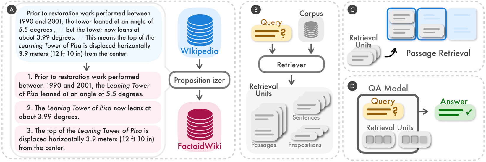
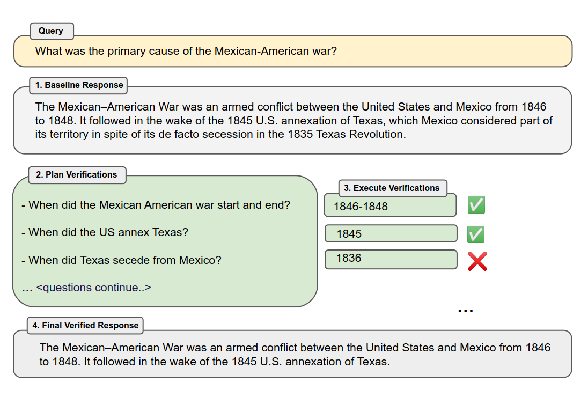

## Retrival

### Dense 𝕏  (Retrieval Granularity)
Through our experiments on five open-domain QA datasets with six different dense retrievers, we discovered that retrieval by proposition outperforms passage or sentence in both passage retrieval accuracy and downstream QA performance with a fixed retrieved word budget.

[repository](https://github.com/chentong0/factoid-wiki)

[paper](https://arxiv.org/html/2312.06648v2/#S1.F2)

## Indexing Optimization

### Small2Big (Chunking Strategy)
Smaller Child Chunks Referring to Bigger Parent Chunks: Fetch smaller chunks during retrieval first, then reference the parent IDs, and return the bigger chunks.

[link](https://towardsdatascience.com/advanced-rag-01-small-to-big-retrieval-172181b396d4)

### Reverse HyDE (Metadata chunk)

In addition to extracting metadata from the original documents, metadata can also be artificially constructed. For example, adding summaries of paragraph, as well as introducing hypothetical questions. This method is also known as Reverse HyDE. Specifically, using LLM to generate questions that can be answered by the document, then calculating the similarity between the original question and the hypothetical question during retrieval to reduce the semantic gap between the question and the answer

### Knowledge Graph index (Structural Index)

## Query Optimization

### Chain-of-Verification(CoVe) (Query expansion)
problem:

solution:

1.  Generate Baseline Response: Given a query, generate the response using the LLM.
2. Plan Verifications: Given both query and baseline response, generate a list of verification
questions that could help to self-analyze if there are any mistakes in the original response.
3. Execute Verifications: Answer each verification question in turn, and hence check the answer
against the original response to check for inconsistencies or mistakes.
4. Generate Final Verified Response: Given the discovered inconsistencies (if any), generate a
revised response incorporating the verification results.

Each of these steps is performed by prompting the same LLM in different ways to obtain the desired
response. While steps (1), (2) and (4) all can be invoked with a single prompt, we investigate
variations of step (3) including joint, 2-step and factored versions. These variants either involve a
single prompt, two prompts or else independent prompts per question, where more sophisticated
decomposition can yield improved results.

[repository](https://github.com/ritun16/chain-of-verification.git)

[link](https://sourajit16-02-93.medium.com/chain-of-verification-cove-understanding-implementation-e7338c7f4cb5)

[chat_example](https://chatgpt.com/share/e/4c8f67eb-c7c1-44f1-a96f-d2aca07ea1f7)

## Embedding

There is no one-size-fits-all answer to “which embedding model to use.” However, some specific models are better suited for particular use cases. (BM25, BERT, AngIE, Voyage, BGE, etc)

